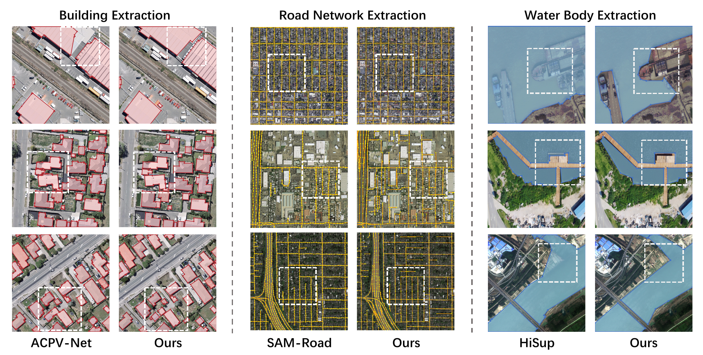
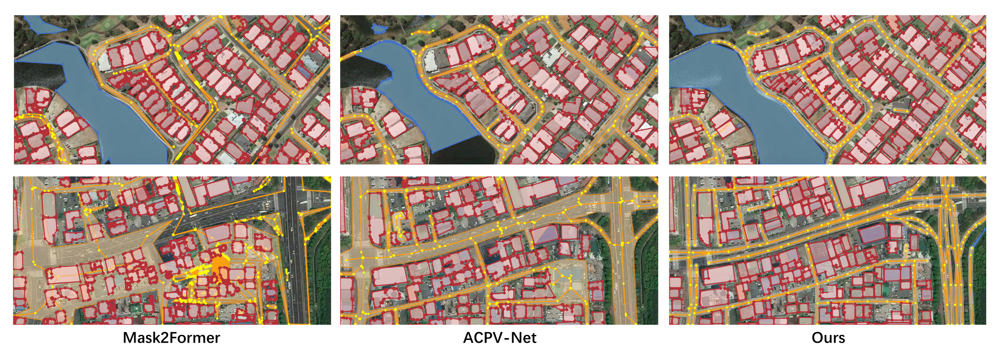

# VecLang: Vector Map as Language

<p align="center">
  <b>A Unified Vision-Language Framework for Remote Sensing Vector Mapping</b>
</p>

<p align="center">
  <a href="#overview">Overview</a> |
  <a href="#results">Results</a> |
  <a href="#release-plan">Release Plan</a> |
  <a href="#todo">Todo</a> |
  <a href="#citation">Citation</a>
</p>

## Overview

**VecLang** formulates remote sensing vector mapping as **structured language generation**. Instead of relying on category-specific polygon or graph representations, VecLang represents heterogeneous map entities with a shared **Structured Vector Language (SVL)**, where geometry, semantics, and topology are organized in a unified GeoJSON-like language space.

VecLang supports both closed-structure objects, such as **buildings** and **water bodies**, and network-like objects, such as **roads**, enabling unified modeling of diverse vector mapping tasks.

## Highlights

- **Vector Map as Language:** Reformulates remote sensing vector mapping as structured text generation.
- **Unified Representation:** Represents geometry, semantics, and topology in a shared vector-language format.
- **Progressive Vectorization:** Localizes vectorization units before generation to improve stability and efficiency.
- **Hierarchical Optimization:** Improves syntactic validity, content consistency, and execution fidelity.
- **Broad Evaluation:** Supports single-class, multiclass, cross-dataset, open-vocabulary, and large-scale vector mapping settings.

## Results

### Single-Class Vector Mapping

VecLang generates regular building outlines, compact waterbody polygons, and continuous road structures within the same language-based framework.

<p align="center">
  
</p>

<p align="center">
  <b>Single-class vector mapping visualization.</b>
  <a href="assets/results/single_class_viz.pdf">PDF version</a>
</p>

### Multi-Class Vector Mapping

VecLang jointly predicts buildings, roads, and water bodies in the same scene, preserving both instance-level boundaries and network connectivity.

<p align="center">
  
</p>

<p align="center">
  <b>Multi-class vector mapping visualization.</b>
  <a href="assets/results/multi_class_viz.pdf">PDF version</a>
</p>

### Large-Scale Vector Mapping

Large-scale visualization results will be added soon. VecLang can be applied to large remote sensing scenes by progressively generating localized vectorization units and merging them into complete vector maps.

## Release Plan

We are preparing a clean and reproducible release. The paper, data, checkpoints, and scripts will be released progressively.

| Component | Description | Status |
| --- | --- | --- |
| Paper | Full paper and technical details | Coming soon |
| Code | Training, inference, and evaluation scripts | In progress |
| VecMap-Bench | Benchmark data for unified vector mapping | In progress |
| SVL Annotations | Structured Vector Language annotations | In progress |
| Model Weights | Pretrained and fine-tuned VecLang checkpoints | In progress |
| Visualization Results | Qualitative examples and demo figures | Updating |
| Documentation | Usage instructions and data format description | Updating |

## Todo

- [ ] Release the paper.
- [ ] Release the full VecLang codebase.
- [ ] Release VecMap-Bench and SVL annotations.
- [ ] Release pretrained and fine-tuned model weights.
- [ ] Provide inference scripts for single-image and large-scale vector mapping.
- [ ] Provide training and post-training scripts.
- [ ] Provide evaluation scripts for polygonal objects and road networks.
- [ ] Add examples for custom data conversion to SVL.

## Repository Structure

```text
VecLang/
├── assets/
│   └── results/
│       ├── single_class_viz.pdf
│       ├── single_class_viz.png
│       ├── multi_class_viz.pdf
│       └── multi_class_viz.png
├── README.md
└── LICENSE
```

## Quick Start

The complete environment setup, model checkpoints, and inference scripts will be released soon.

```bash
git clone https://github.com/yyyyll0ss/VecLang.git
cd VecLang
```

## Structured Vector Language

VecLang represents vector maps with a GeoJSON-like structured language. A polygonal object can be represented as:

```json
[
  {
    "type": "Feature",
    "geometry": {
      "type": "Polygon",
      "coordinates": [x1, y1, x2, y2, "...", xn, yn]
    },
    "properties": {
      "class": "Building"
    }
  }
]
```

For road networks, SVL can further encode line geometry and topological relations, enabling structured and executable vector-map generation.

## Citation

If you find this project useful, please consider citing our work:

```bibtex
@article{veclang2026,
  title={VecLang: Vector Map as Language for Unified Remote Sensing Vector Mapping},
  author={},
  journal={},
  year={2026}
}
```

## Acknowledgement

We thank the open-source community and prior works on remote sensing vector mapping, vision-language models, and structured map generation.
