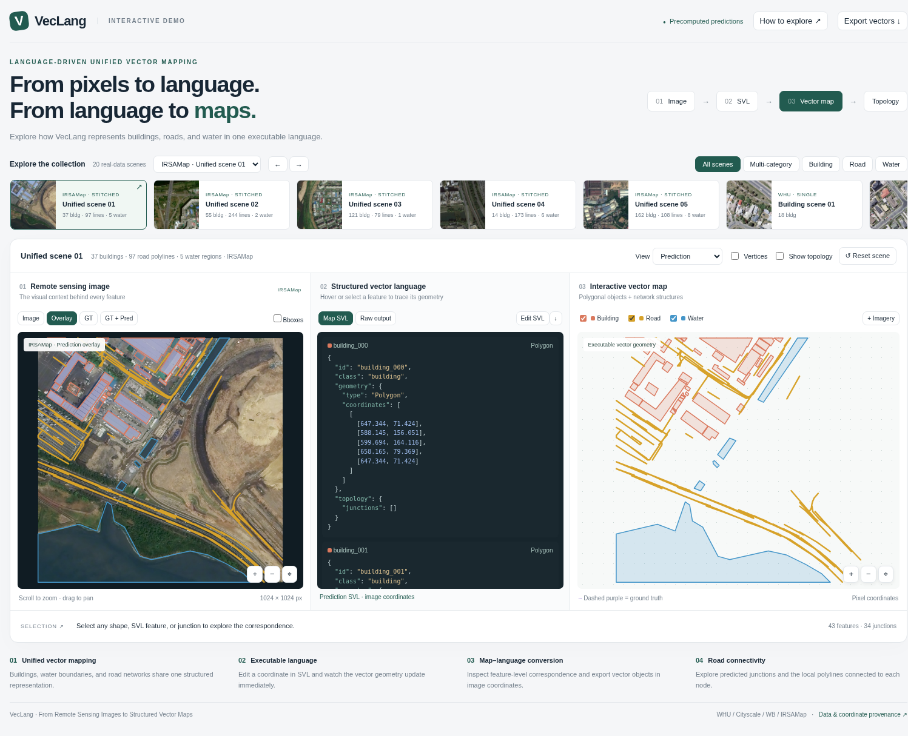

# VecLang Interactive Demo

GitHub 发布包含源码、20 个展示案例、主页截图与 `VecLang-Standalone.html`。
下载单文件 HTML 后用浏览器打开即可交互；GitHub 文件预览本身不执行 JavaScript。
下文中的 `dist/`、ZIP 和验证报告是本地构建产物，不随源码提交；可按构建命令生成。

用于论文展示的离线交互 Demo：**Image ↔ Structured Vector Language ↔ Vector Map**。默认展示 IRSAMap 多类别场景，所有首页案例均来自已有模型推理结果。无需模型权重、GPU、数据库、CDN 或推理服务。



## 最方便的打开与上传方式

**直接双击 `VecLang-Standalone.html`（约 6.7 MB）。** 影像、样例数据、样式、JavaScript 均已内嵌；复制这一个文件即可分享，断网也能使用。

- 静态网站：上传 `dist/` 中的内容，入口为 `index.html`。
- 论文补充材料：使用 `artifacts/VecLang-demo-site.zip`，或直接附上单文件 HTML。
- Jupyter：将 `VecLang_Demo.ipynb` 和 `VecLang-Standalone.html` 放在同一文件夹，运行 notebook。首次打开需要信任 notebook 才能执行交互 HTML；GitHub 的 notebook 静态预览不执行 JavaScript。
- 源代码交付：`artifacts/VecLang-demo-source.zip` 包含源码、数据准备脚本、20 个案例和 notebook。

## 本地开发

Node.js 18+；没有 npm 第三方依赖。

```bash
cd VecLang/demo
npm install
npm run dev
```

打开 `http://127.0.0.1:4173`。这是静态文件预览服务器，没有 Python backend 或模型服务。远程机器可通过 SSH 转发端口：

```bash
ssh -L 4173:127.0.0.1:4173 user@server
```

```bash
npm test
npm run build
npm run preview
```

构建同时生成 `dist/index.html` 和 `VecLang-Standalone.html`。单文件版本支持 `file://` 直接打开。源码入口 `index.html` 使用 ES modules / fetch，应通过 `npm run dev` 打开。

## 已实现的交互

- 20 个真实案例的缩略图 Gallery、单类 / 多类筛选；URL hash 可定位案例，例如 `#road_01`。
- 三栏联动：影像、SVL feature、矢量对象的 hover / 点击高亮；GT 与预测分别保持 ID 对应。
- 两个 SVG 矢量画布同步缩放、平移、Fit；直接交互 Polygon / MultiLineString，无静态预测 PNG。
- Prediction / Ground truth / Prediction + GT，影像独立叠加模式；GT 为紫色虚线。
- Building / Road / Water 图层，Polygon 内环支持，顶点显示，影像检测框图层。
- 点击道路 junction，显示其 degree、connected polylines，并高亮连接的折线和 SVL 中对应 junction ID。
- `Map SVL` 展示统一影像坐标的可执行表示；`Raw output` 展示未经改写的模型文本。
- `Edit SVL` 编辑当前预测 feature：坐标、建筑 / 水体类别、junction 坐标。有效 JSON 即时更新地图；无效编辑保留上一份有效几何并显示原因；Reset 恢复原始预测。
- 导出当前预测（含本地编辑）或 GT 的 GeoJSON，以及原始 / 统一 SVL。

## 真实数据与来源

单类别维持 WHU 建筑 **5** 个、WB 水体 **5** 个、Cityscale 道路 **5** 个；IRSAMap 多类别精选五个，共 **20** 个。三个单类别的 15 个案例文件保持不变。

IRSAMap 道路已按用户指定顺序执行 `1.extract_road_instance_patch.py` → `2.stitch_coco_polylines.py`，输入包括候选场景的**全部重叠道路 patch**，参数为原始裁剪 128、模型 patch 256、stride 64，其余使用脚本 CLI 默认值。页面、SVL、junction 和导出 GeoJSON 使用同一份拼接图。

从原有十个候选场景处理后的结果中，结合道路 / 标签对照、建筑水体重叠程度和影像可读性选取五个。内部选例评分不作为论文 benchmark；十个候选的拼接结果、命令、日志、原始 patch 记录和视觉对照均保存在 `artifacts/road_stitching/`。

| 案例 | IRSAMap 影像 | 建筑 | 拼接图折线链 | 水体 | 拼接图 junction |
|---|---|---:|---:|---:|---:|
| multi_01 | 102.png | 37 | 97 | 5 | 34 |
| multi_02 | 308.png | 55 | 244 | 2 | 101 |
| multi_03 | 702.png | 121 | 79 | 1 | 23 |
| multi_04 | 345.png | 14 | 173 | 6 | 72 |
| multi_05 | 505.png | 162 | 108 | 8 | 35 |

拼接图折线链在度数不为 2 的节点处分段，不等同于原始 patch polyline 数或独立道路数量。它们保留 `.p` 图的全部非自环无向边；没有额外手工补线。页面取消固定最大宽度，两侧留白为 12–20 px；Gallery 支持数量显示、翻阅和快速跳转。

指定的推理目录：

```text
new_model/Qwen3-VL-SFT-0502/
├── eval_2026-05-02-22-05-43-instance/
└── eval_2026-05-03-22-20-43-object-detection/
```

每个 `raw-svl.json` 记录预测文件名、1-based 行号、原始影像路径、原始 predict / label 文本和坐标变换。`metadata.json` 记录数据来源、坐标约定和重建校验。发布文件不依赖上述原始目录。

### 坐标还原与展示边界

- 模型原始坐标是实例 / patch 内归一化的 `[0,1000]`；Map SVL 使用**当前场景影像像素坐标**，原点左上角，x 向右，y 向下。
- WHU / WB：从原始 COCO 实例 bbox 和仓库 `crop_instance(scale_factor=1.3)` 恢复裁剪范围，采用 `scene_x = crop_x + raw_x × crop_w / 1000`，y 同理。标签按同一变换还原。
- IRSAMap：COCO 的 `source_image`、`source_feature_index`、patch 偏移用于恢复原图对象 bbox；用原裁剪算法重建输入图像，再与已有 256×256 实例图进行像素校验。四个 512×512 影像 patch 还原为同一 1024×1024 场景。
- IRSAMap 道路：原始窗口 128×128，模型输入放大为 256×256。将源文件名适配为第二个脚本要求的 `region_<region>_patch_<patch>_<x>_<y>.png`，按原始 manifest 行号构造第一个脚本使用的 COCO images 索引。索引只提供影像信息，不伪装为额外 GT。提取后对全部重叠 patch 进行区域拼接，包含脚本默认的节点合并、端点吸附、边界连接及平行边处理。脚本本身未被修改。
- 多类页面是**同一场景的各类别离线预测的统一组织与展示**，不声称这些文件来自一次联合解码。
- 检测与矢量是两次独立评估：检测框可叠加查看，不把它们伪装为已匹配的 detector → vector 级联结果。提供的 Cityscale 结果没有检测任务，因此该案例 Bboxes 不可用。
- IRSAMap junction 来自拼接区域图中度数 ≥ 3 的节点；连接关系使用精确共享端点，不使用邻近容差来虚构连接。`topology.mode` 为 `stitched-graph`。Cityscale 单类保留原先的 patch 预测 junction 和 2 像素局部 incidence。degree 是分支数；闭合折线链在同一 junction 的两个端点贡献 2 条分支。
- 建筑、水体和单类道路 GT 保留原始评估 label。IRSAMap 道路 GT 使用完整源 manifest 的 assistant 标签，独立执行相同提取与拼接流程；不是额外取得的原始整幅 GIS 路网 GT。`road_network` 为整幅场景级 ID，原始多个 road patch 到它是多对一关系；不能将拼接后 SVL 声称为模型直接生成的原始文本。
- 原始模型水体存在 `properties.holes` 时转换为 Polygon 的内环。当前案例不添加人工 holes；孔洞支持由解析测试覆盖。
- GeoJSON 保留标准 FeatureCollection / Polygon / MultiLineString 嵌套结构，但坐标是**本地图像像素，非 RFC 7946 的 WGS84 经纬度**。用于地理 GIS 叠加前，需要补充真实 CRS 和仿射变换，不能假装已有地理配准。
- 示例为展示选例，不用于汇总性能评测。截断或无法解析的输出不被修写为假预测；数据准备脚本跳过它们，IRSAMap 的排除项记录在 metadata 中。

## 目录结构

```text
demo/
├── VecLang-Standalone.html       # 可直接打开的单文件交付
├── VecLang_Demo.ipynb            # 可选 notebook 包装
├── index.html                   # 源码入口
├── package.json / package-lock.json
├── src/
│   ├── app.js                   # 界面状态和三栏交互协调
│   ├── theme.css                # 统一颜色和响应式样式
│   ├── components/
│   │   ├── VectorViewer.js      # 原生 SVG 矢量画布 / 相机 / junction
│   │   └── SVLViewer.js         # 代码高亮 / feature 定位 / 编辑器
│   └── lib/
│       ├── caseLoader.js        # StaticCaseProvider / 下载
│       ├── geometry.js          # SVL 校验 / GeoJSON / topology / ID
│       └── types.d.ts           # 数据契约和未来 InferenceProvider
├── public/cases/
│   ├── index.json
│   └── <case_id>/
│       ├── image.jpg / thumbnail.jpg
│       ├── prediction.geojson / gt.geojson
│       ├── svl.json / raw-svl.json
│       ├── topology.json / gt-topology.json
│       └── metadata.json / detections.json
├── scripts/
│   ├── prepare_cases.py         # 从指定离线结果重建展示资产
│   ├── stitch_demo_roads.py    # 顺序执行仓库道路提取 / 拼接脚本
│   ├── apply_stitched_cases.py # 将五个区域图应用到展示案例
│   ├── review_stitched_roads.py # 仅用于选例的影像 / GT 对照
│   ├── build.mjs / serve.mjs    # 零依赖构建 / 静态预览
│   └── package_release.py      # notebook 和 ZIP 打包
├── tests/                      # 几何解析、来源校验、浏览器交互
├── dist/                       # 静态部署文件
└── artifacts/                  # 截图、校验报告和 ZIP
```

选择原生 SVG / JavaScript 是为了让单文件 HTML 真正离线可用，降低上传负担。界面与数据解析分离；没有引入 React / Monaco / 地图瓦片运行时。

## 数据格式与替换案例

新增 `public/cases/<id>/`，沿用任一真实案例的数据结构，并在 `public/cases/index.json` 中添加 metadata。随后 `npm run build` 重新内嵌案例。

```json
{
  "version": "veclang-demo/1",
  "coordinateSystem": {"type": "image-pixel", "origin": "top-left", "georeferenced": false},
  "features": [{
    "id": "building_001", "class": "building",
    "geometry": {"type": "Polygon", "coordinates": [[[10,10],[80,10],[80,60],[10,10]]]},
    "topology": {"junctions": []}
  }]
}
```

拼接道路 feature 的 `topology.mode` 为 `stitched-graph`，junction 连接由折线链的精确端点计算；原始模型 patch 文本在 `raw-svl.json` 中另行保留。

Polygon 的第一条 ring 为外环，其余为内环；各 ring 必须闭合。MultiLineString 是 `[polyline][vertex][x,y]`。所有 SVL、GeoJSON 和 topology 对象通过相同 feature ID 关联；junction 的 `featureId` 指向所属道路 feature。预测 / GT 的 topology 文件分别维护，不能用预测 junction 冒充 GT。

未来在线服务可实现 `src/lib/types.d.ts` 中的 `InferenceProvider.predict(image: File): Promise<VecLangResult>`。当前入口只使用 `StaticCaseProvider.load(id)`，不实现任意影像上传或远程推理。

### 从当前仓库重新准备真实资产

需要 Python 3.9+、NumPy、OpenCV、Pillow、SciPy、tqdm，仅数据准备与校验使用，网页运行不需要 Python。

```bash
python scripts/prepare_cases.py  # 自动准备候选、执行两步道路处理、发布 20 个案例
python tests/verify_data.py
npm test
npm run build
python scripts/package_release.py
```

`prepare_cases.py` 默认解析当前仓库相对路径。更换机器数据布局时修改脚本顶部 DATA / VEC / DET。`--prepare-only` 只准备 25 个候选，不用于最终发布；正常运行会继续执行两步道路处理和五场景筛选。最终区域列表在 `apply_stitched_cases.py` 的 `SELECTED` 中，候选快照用于重现选例。

仅重跑道路流程而不重建其他类别：

```bash
python scripts/stitch_demo_roads.py
python scripts/review_stitched_roads.py
python scripts/apply_stitched_cases.py
npm test
python tests/verify_data.py
npm run build
python scripts/package_release.py
```

道路提取脚本的 `--gt-file` 参数在此传入 `patch_index.json`；该脚本实际使用其中的 images 顺序和大小。索引通过逐行核对 manifest / 推理 label 建立，避免靠文件名字典序猜测匹配。`provenance.json` 保存两份仓库脚本的 SHA256 和实际执行命令；prediction 与 GT 分别记录完整日志。

## 静态部署

- GitHub Pages：将 `dist/` 内容放在发布分支根目录，或通过 Actions 上传 Pages artifact。构建结果使用内嵌资源，不受仓库子路径影响。
- Vercel / Cloudflare Pages：项目根目录设为 `VecLang/demo`，构建命令 `npm run build`，输出目录 `dist`。
- 任意静态托管：解压 `artifacts/VecLang-demo-site.zip` 即可。

## 验证

`npm test` 覆盖精确拼接图 incidence、闭合折线链度数、邻近但不相连折线，以及真实案例 SVL → GeoJSON 往返、ID 唯一性、孔洞、无效坐标、闭环校验、junction 度数与编辑后连接更新。

`python tests/verify_data.py` 核对原始预测文本、行号、预测 / GT 坐标变换，并用原始输入影像验证重建裁剪；同时逐条比较发布道路几何与 `.p` 区域图的无向边，验证 junction 度数；结果写入 `artifacts/data-validation.json`。

`tests/browser_check.py` 使用本机 Chrome DevTools 与 Python requests / websocket-client 检查所有案例切换、实际鼠标点击三栏联动、junction、GT、图层、检测框、原始 SVL、有效 / 无效编辑、Reset、缩放和移动端宽度。需先启动 Chrome 的 `--remote-debugging-port=9227`；开发版使用本地 URL，单文件版传入 `file:///.../VecLang-Standalone.html`。
